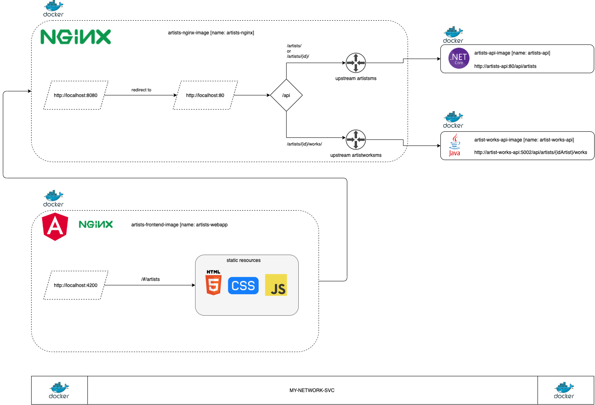

# learning-architecture-containers > VERSION 03



Para o exercício version_03, utilizaremos o `docker-compose` para nos auxiliar a subir os serviços.


## 1- Buildar imagem artists-frontend (COM DOCKER-COMPOSE)

```
Caminho:
/learning-architecture-containers/solutions
```

Modifique o arquivo `docker-compose.yaml` e inclua o conteúdo:

```yaml
artists-webapp:
    build: ../solutions/artists-frontend
    ports:
    - "4200:4200"
    networks:
    - my-network-svc
```

## 2- Executar o docker-compose

```
Caminho: 
/learning-architecture-containers/solutions

# remove todas as imagens
docker compose down --rmi 'all'

# recria as imagens
docker compose up -d
```


Você pode testar chamando a URL de `artists-frontend`: 

a. http://localhost:4220/#/artists/

Você pode testar chamando a URL de `artists-backend`: 

a. http://localhost:5001/api/artists/

b. http://localhost:5001/api/artists/1/


Você pode testar chamando a URL de `artist-works-backend`: 

a. http://localhost:5002/api/artists/1/works/


Você pode testar chamando a URL de `artists-nginx`:  

a. http://localhost:8080/api/artists/

b. http://localhost:8080/api/artists/1/

c. http://localhost:8080/api/artists/1/works/
