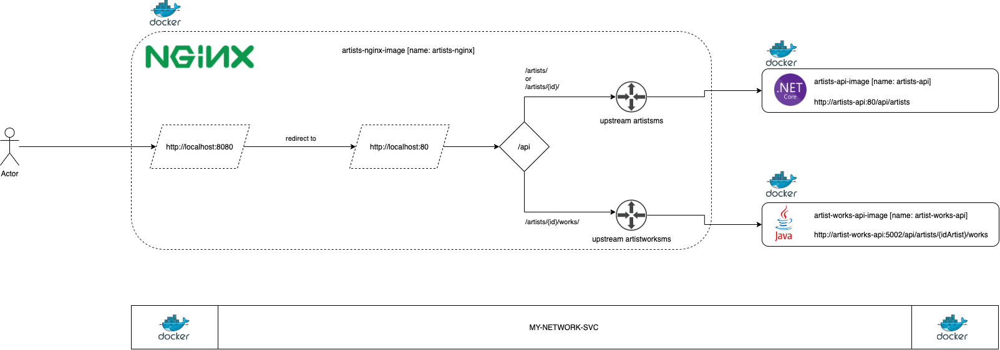

# learning-architecture-containers > VERSION 02



Para o exercício version_02, utilizaremos o `docker-compose` para nos auxiliar a subir os serviços.

## Executar o docker-compose

```
Caminho: 
/learning-architecture-containers/solutions

docker compose up
```

Você pode testar chamando a URL de `artists-backend`: 

a. http://localhost:5001/api/artists/

b. http://localhost:5001/api/artists/1/


Você pode testar chamando a URL de `artist-works-backend`: 

a. http://localhost:5002/api/artists/1/works/


Você pode testar chamando a URL de `artists-nginx`:  

a. http://localhost:8080/api/artists/

b. http://localhost:8080/api/artists/1/

c. http://localhost:8080/api/artists/1/works/
