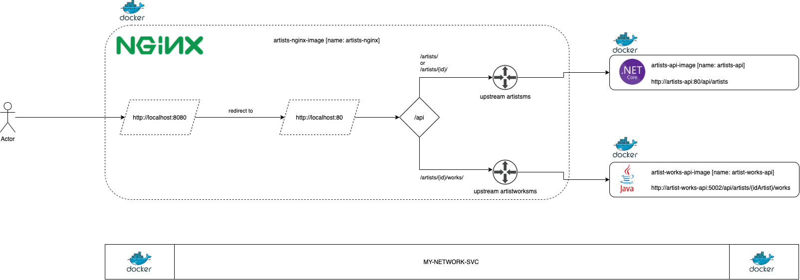

# learning-architecture-containers > VERSION 01



a. Toda a requisição que chegar na porta 8080, redireciona internamente para porta 80

b. Se uma requisição chegar na URI /api, verifica se:

b1. Se /api/artists/ OU /api/artists/1/, redireciona para artists-api:80

b2. Se /api/artists/1/works/, redireciona para artist-works-api:80

## 1- Criar uma rede no Docker

```
docker network create my-network-svc 
```

## 2- Buildar imagem NetCore

```
Caminho: 
/learning-architecture-containers/solutions/artists-backend/artists

docker build -t artists-api-image .

docker run -d -p 5001:80 --name artists-api --network my-network-svc artists-api-image
```

Você pode testar chamando a URL: 

a. http://localhost:5001/api/artists/

b. http://localhost:5001/api/artists/1/


## 3- Buildar a imagem Java

Para o comando `mvn clean compile package` você precisa instalar previamente o Maven, ou utilizar alguma IDE para tal (seja o Eclipse, IntelliJ etc).

```
Caminho:
/learning-architecture-containers/solutions/artist-works-backend/artist-works

mvn clean compile package

docker build -t artist-works-api-image .

docker run -d -p 5002:5002 --name artist-works-api --network my-network-svc artist-works-api-image
```

Você pode testar chamando a URL: 

a. http://localhost:5002/api/artists/1/works/


## 4- Buildar a imagem NGINX

```
Caminho:
/learning-architecture-containers/solutions/nginx

docker build -t artists-nginx-image .

docker run -d -p 8080:8080 --name artists-nginx --network my-network-svc artists-nginx-image
```

Você pode testar chamando as URLs: 

a. http://localhost:8080/api/artists/

b. http://localhost:8080/api/artists/1/

c. http://localhost:8080/api/artists/1/works/


## Para testar a comunicação entre as máquinas (se estão na mesma rede), instale os pacotes ping e curl

```
apt-get update && apt-get install iputils-ping && apt-get install curl
```
