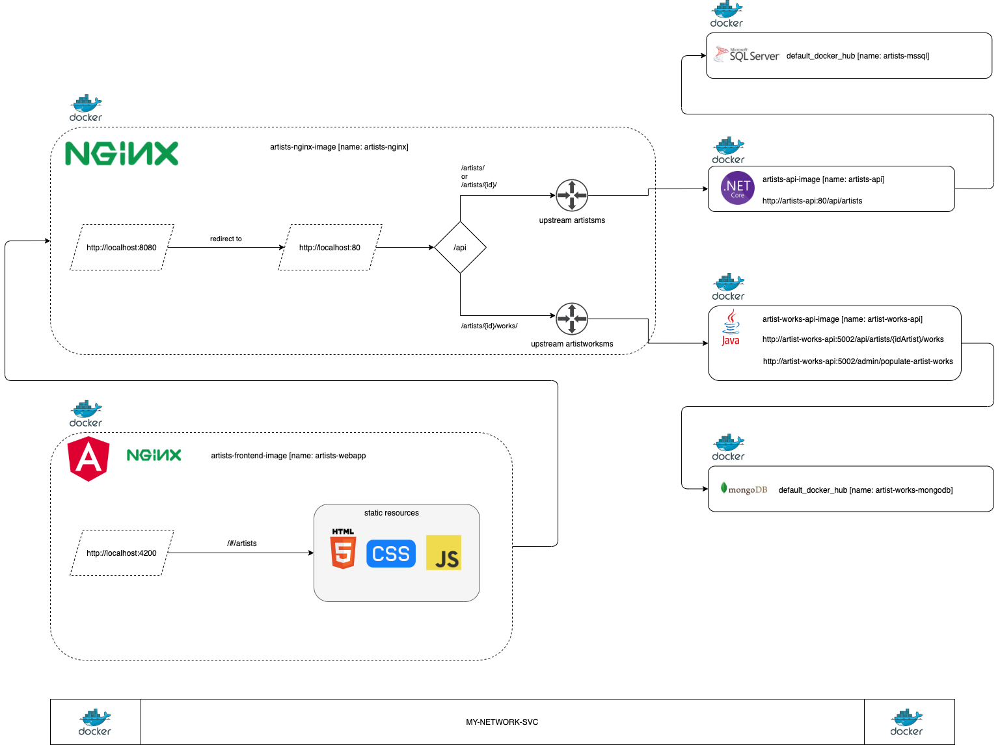

# learning-architecture-containers > VERSION 04



A. API .Net Core utilizando SQL Server

B. API Java utilizando MongoDB

C. Melhoria no docker-compose para definir dependencia entre services

D. Refactoring do código

## MongoDB para API artist-works-api

Modifique o arquivo `docker-compose.yaml` e inclua o conteúdo:

```yaml
artist-works-mongodb:
    image: mongo
    ports:
    - "27017:27017"
    environment: 
        - MONGO_INITDB_ROOT_USERNAME=mongo
        - MONGO_INITDB_ROOT_PASSWORD=secret@123
```

### Carga MONGODB

Ao subir os serviços com `docker-compose`, execute a URL de carga:

```
http://localhost:5002/admin/populate-artist-works
```

## SQL Server para API artists-api

Modifique o arquivo `docker-compose.yaml` e inclua o conteúdo:

```yaml
artists-mssql:
    image: mcr.microsoft.com/mssql/server:2017-latest
    ports:
    - "1433:1433"
    environment: 
        - ACCEPT_EULA=Y
        - SA_PASSWORD=secret@456
```

### Script SQL

Ao subir os serviços com `docker-compose`, conecte-se com seu banco de dados e execute o script:

```
Caminho:
/learning-architecture-containers/solutions/artists-mssql/ddl_script.sql
```


Você pode testar chamando a URL de `artists-frontend`: 

a. http://localhost:4220/#/artists/

Você pode testar chamando a URL de `artists-backend`: 

a. http://localhost:5001/api/artists/

b. http://localhost:5001/api/artists/1/


Você pode testar chamando a URL de `artist-works-backend`: 

a. http://localhost:5002/api/artists/1/works/

b. http://localhost:5002/admin/populate-artist-works


Você pode testar chamando a URL de `artists-nginx`:  

a. http://localhost:8080/api/artists/

b. http://localhost:8080/api/artists/1/

c. http://localhost:8080/api/artists/1/works/
